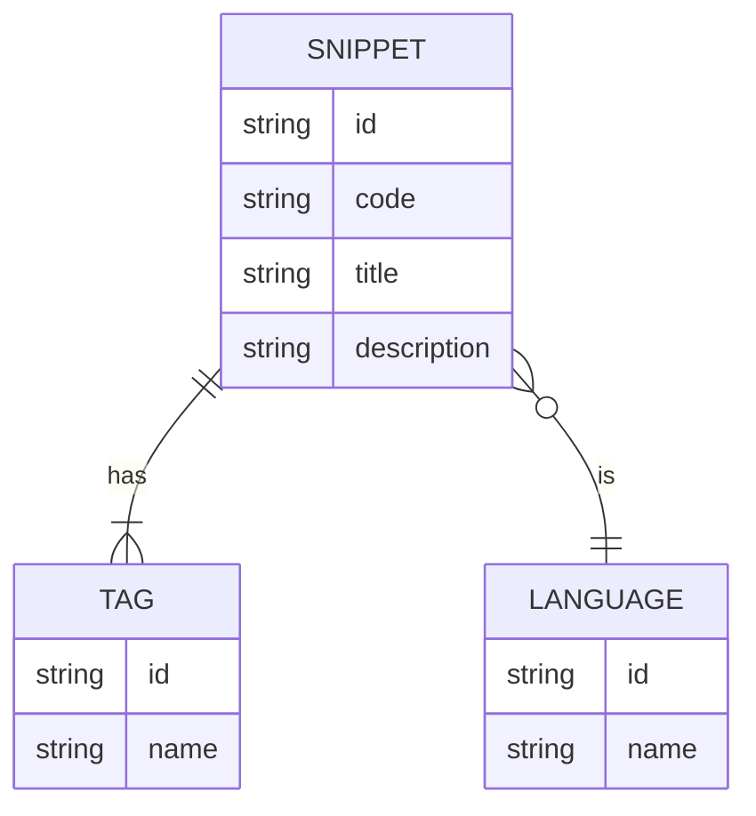

# Project 2: Code snippet library

## Schema



## Api Endpoints

### Get all snippets

**Endpoint**
`<baseurl>/api/getall`

**Query Parameters**

- `lang` - filter snippets by language.
- `tags` - filter by tag. Allows multiple tag seperated by comma.
- `limit` - number of results per page (default 10).
- `cursor` - cursor for pagination.

**Response Format**

```json
{
  "data": [
    {
      // Snippet data
    }
  ],
  // Cursor for next page | null if there is no next page
  "nextCursor": "64a123abc456def7891"
}
```

### Get a snippet by ID

**Endpoint**
`<baseurl>/api/<ID>`

### Create a new snippet

**Endpoint**
`<baseurl>/api/add`

**Request payload**

| Field         | Type   | Required | Description                                                        |
| ------------- | ------ | -------- | ------------------------------------------------------------------ |
| `title`       | string | Yes      | Snippet title                                                      |
| `code`        | string | Yes      | The code snippet                                                   |
| `description` | string | Yes      | Description of the snippet                                         |
| `lang`        | string | Yes      | Programming language of the snippet (e.g., `javascript`, `python`) |
| `tags`        | array  | Yes      | Array of tag names (strings), e.g., `["array", "loop"]`            |

**Example Payload**

```json
{
  "title": "Pointer Example",
  "code": "int x=10;\nint *ptr=&x;\nprintf(\"%d\", *ptr);",
  "description": "Basic pointer usage in C",
  "lang": "c",
  "tags": ["pointer", "example"]
}
```

### Update a snippet

**Endpoint**
`<baseurl>/api/update/<id>`

**Request payload**

> All fields are optional but at least one is required.

| Field         | Type   | Description                                              |
| ------------- | ------ | -------------------------------------------------------- |
| `title`       | string | Snippet title (cannot be empty if provided)              |
| `code`        | string | Code snippet (cannot be empty if provided)               |
| `description` | string | Description of the snippet (cannot be empty if provided) |
| `lang`        | string | Programming language (e.g., `javascript`, `python`)      |
| `tags`        | array  | Array of tag names (strings), e.g., `["array", "loop"]`  |

**Example Payload (PATCH)**

```json
{
  "title": "Updated For Loop Example",
  "tags": ["array", "loop", "example"]
}
```

### Delete a snippet

**Endpoint**
`<baseurl>/api/delete/<id>`

## Running locally

```shell
    git clone https://github.com/kumang-subba/proj-2-snippets.git && cd proj-2-snippets
    npm i
    npm run start
```

## Environment variables:

```dotenv
MONGO_DB_URI=<your_mongo_db_url>
```
